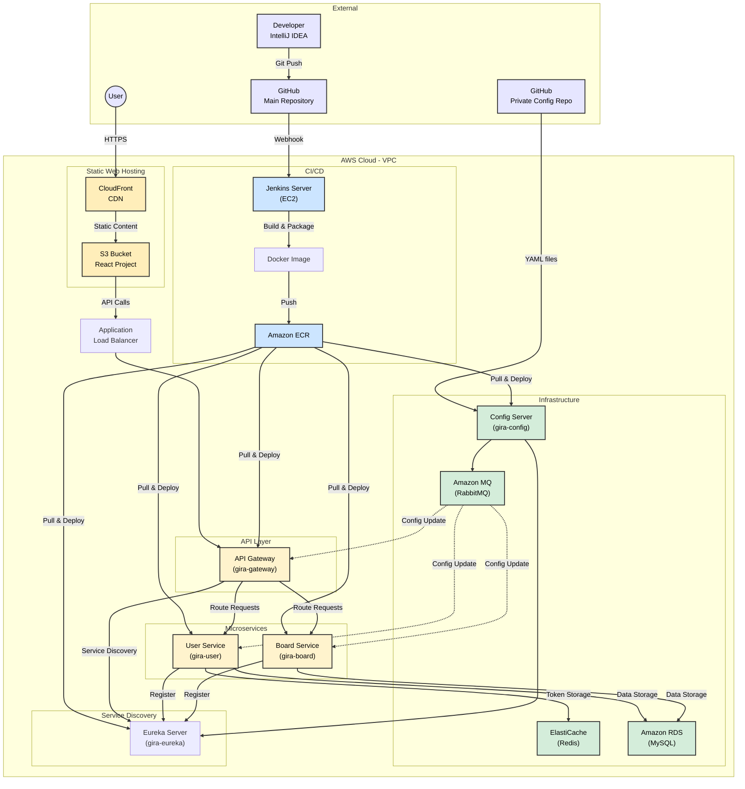

# GIRA - MSA 기반 프로젝트

## 📋 프로젝트 소개
GIRA는 Spring Cloud 기반의 마이크로서비스 아키텍처(MSA)를 활용한 프로젝트입니다. 서비스 간의 독립적인 확장성과 유지보수성을 확보하기 위해 MSA 패턴을 적용했습니다.

## 🏗️ 시스템 아키텍처

### 마이크로서비스 구성
- **Eureka Server** (gira-eureka, port: 8761)
  - 서비스 디스커버리
  - 서비스 등록 및 관리
  
- **API Gateway** (gira-gateway, port: 8181)
  - 라우팅 및 로드밸런싱
  - JWT 기반 인증/인가
  - Circuit Breaker (Resilience4j)
  
- **User Service** (gira-user, port: 8182)
  - 사용자 관리
  - 인증/인가 처리
  - Redis를 통한 토큰 관리
  - MySQL을 통한 데이터 저장
  
- **Board Service** (gira-board, port: 8183)
  - 게시판 관리
  - 이슈 트래킹
  - MySQL을 통한 데이터 저장

### 프론트엔드 구성
- **React Project**
  - S3 버킷에 정적 호스팅
  - CloudFront를 통한 CDN 서비스
  - HTTPS를 통한 API 통신

### 인프라 구성
- **Config Server** (gira-config)
  - GitHub Private Repository에서 설정 파일 관리
  - 환경별 설정 분리 (local/dev)
  
- **Message Queue**
  - Amazon MQ (RabbitMQ)를 통한 설정 갱신
  - Spring Cloud Bus 활용

- **Database**
  - ElastiCache (Redis): 토큰 저장
  - Amazon RDS (MySQL): 서비스 데이터 저장

## 🛠️ 기술 스택
- **Framework**: Spring Boot 3.3.5, Spring Cloud 2023.0.3
- **Frontend**: React
- **Build Tool**: Gradle 8.10.2
- **Java Version**: JDK 17
- **Container**: Docker
- **Cloud**: AWS (ECR, EC2, S3, CloudFront, ElastiCache, RDS)
- **CI/CD**: Jenkins
- **Service Discovery**: Eureka
- **Gateway**: Spring Cloud Gateway
- **Circuit Breaker**: Resilience4j
- **Config Management**: Spring Cloud Config
- **Message Queue**: Amazon MQ (RabbitMQ)

## 🚀 배포 환경
- **AWS Region**: ap-northeast-2 (서울)
- **VPC**: 단일 VPC 내 모든 서비스 구성
- **Container Registry**: Amazon ECR
- **Static Hosting**: S3 + CloudFront
- **Deployment**: Multi-EC2 instances

## 📝 Jenkins Pipeline 구성
1. **Source Pull**
   - GitHub 레포지토리에서 소스코드 체크아웃

2. **Build & Push**
   - Docker 이미지 빌드
   - ECR 레포지토리 푸시
   - 이미지 태깅 및 버전 관리

3. **Deploy**
   - EC2 인스턴스에 SSH 접속
   - 컨테이너 배포
   - 서비스별 포트 매핑 (8761, 8181, 8182, 8183)
   - Docker 컨테이너 교체 방식의 무중단 배포

